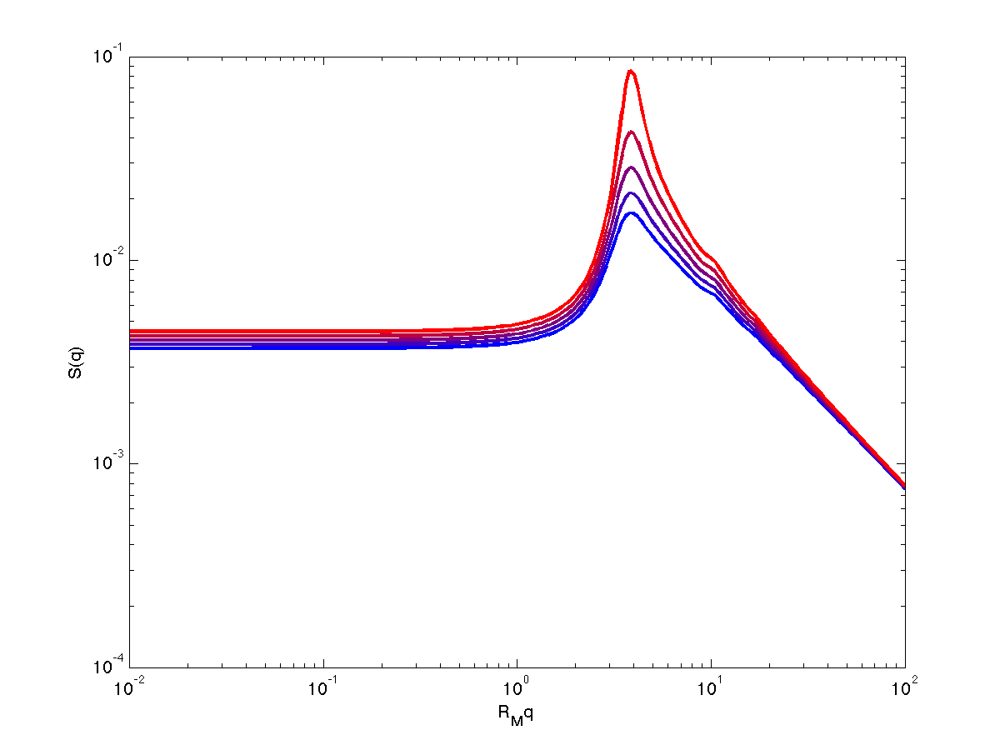

randcopoly
=======================================

<https://github.com/shifanmao1989/randcopoly.git>

This is a function that uses polymer field theory to find phase behavior of random copolymers. The polymers are modeled as wormlike chains, Gaussian chains, and perfectly rigid rods. Phase transition spinodal and critical wavemode of phase segregation can be found at different chemical correlation and monomer rigidities.

simpleexample.m provides a simple example that
- finds spinodal
- finds critical wavemode of instability
- calculates peak sharpness


Here is an example

```
% Example 1: plot density-density correlations vs wavevector at different CHI
N=100;  % total of 100 monomers
NM=10; % each monomer has 10 Kuhn steps
LAM=-0.75; % anti-correlated random copolymer
FA=0.5;    % equal chemical composition

% find spinodal CHIS
[kval,sval]=kmaxwlc(N,NM,FA,LAM);
CHIS=0.5*sval;
CHI=CHIS*[0 0.2 0.4 0.6 0.8];

RM=sqrt(r2wlc(NM));  % end-to-end distance of a monomers
K0=1e-2;  % minimum wavevector
KF=1e2;   % maximum wavevector
NK=201;  % number of wavevectors
K=transpose(logspace(log10(K0),log10(KF),NK))/RM;

% evaluate s2inv
[SINV]=s2invwlc(N,NM,FA,LAM,K);
figure;hold
for I=1:length(CHI)
    COL=(I-1)/(length(CHI)-1);
    loglog(RM*K,1./(-2*CHI(I)+SINV),'-','LineWidth',2,'Color',[COL 0 1-COL])
end
xlabel('R_Mq');ylabel('S(q)')
set(gca,'xscale','log');set(gca,'yscale','log');
axis([K0 KF 1e-2 1e1])
```


example.m provides a number of examples including
- Example 1: plot density-density correlations
- Example 2: find spinodal vs. chemical composition
- Example 3: find critical wavemode vs. chemical correlation
- Example 4: find peak sharpness vs. chemical correlation

plotsim.m compares between mean-field theory and Monte-Carlo simulations
by evaluating density-density correlations. It requires external folder ../results
containing simulation results

folder functions/
consists of functions used in simpleexample.m, example.m, and scripts in mkfigures

folder mkfigures/
consists of scripts for generating figures in manuscript