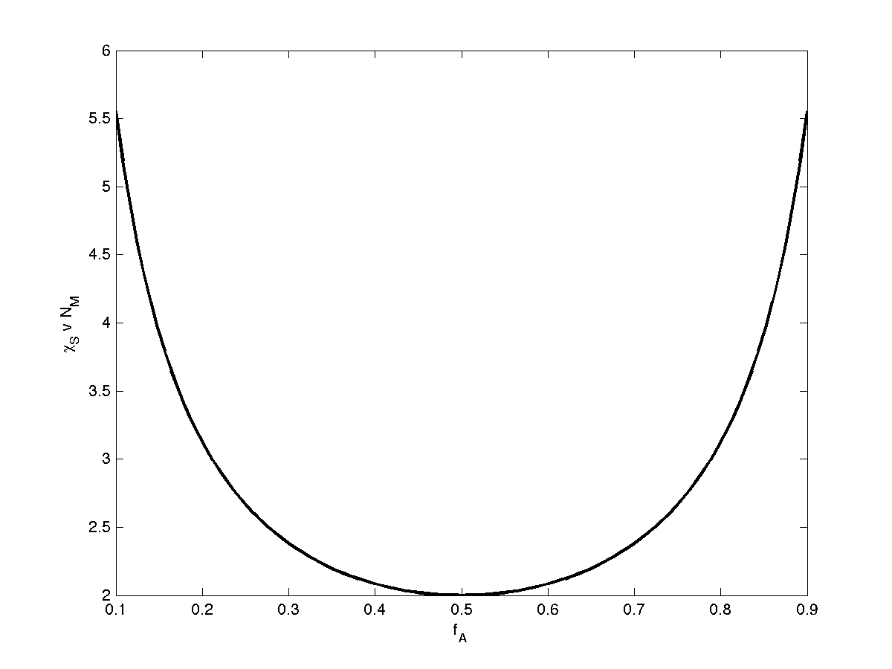

randcopoly
=======================================

This is a package that uses polymer field theory to find phase behavior of random copolymers melt.
The polymers are modeled as wormlike chains.
Given chemical correlation \lambda, number of monomers N, and monomer rigidity NM, it calculates the melt
* structure factor (density-density correlations)
* phase transition Flory-Huggins paramter
* critical wavemode of phase segregation

The package provides two of functions `s2invwlc()` and `kmaxwlc()`.
`s2invwlc()` calculates the structure factor of semiflexible random copolymers in the homogeneous phase.
`kmaxwlc()` finds the critical wavemode (location of peak) in the structure factor.
Similar codes can be found for random copolymers with Gaussian chain model (`s2invgc()` and `kmaxgc()`) and perfectly rigid rod (`s2invrr()` and `kmaxrr()`).

*This package was developed by Shifan Mao, Quinn McPherson, and Andrew Spakowitz* <cite>[1]</cite>

Installation
--------------
Open Matlab and change directory to `randcopoly`. Then add the folder `functions` to path with
``` matlab
addpath('functions')
```

Example Usage
--------------
Here is an example of using the package to calculate the structure factor (density-density correlations) of rigid, anti-correlated random copolymers.

``` matlab
% Example 1: plot density-density correlations vs wavevector at different CHI
N=100;  % total of 100 monomers
NM=0.1; % each monomer has 0.1 Kuhn steps
LAM=-0.75; % anti-correlated random copolymer
FA=0.5;    % equal chemical composition

% find spinodal CHIS
[kval,sval]=kmaxwlc(N,NM,FA,LAM);
CHIS=0.5*sval;
CHI=CHIS*[0 0.2 0.4 0.6 0.8];  % range of CHI values (scaled by spinodal)

RM=sqrt(r2wlc(NM));  % end-to-end distance of a monomers
K0=1e-2;  % minimum wavevector
KF=1e2;   % maximum wavevector
NK=201;  % number of wavevectors
K=transpose(logspace(log10(K0),log10(KF),NK))/RM;

% evaluate s2inv
[SINV]=s2invwlc(N,NM,FA,LAM,K);
figure;hold
for I=1:length(CHI)
    COL=(I-1)/(length(CHI)-1);
    loglog(RM*K,1./(-2*CHI(I)+SINV),'-','LineWidth',2,'Color',[COL 0 1-COL])
end
xlabel('R_Mq');ylabel('S(q)');box on;
set(gca,'xscale','log');set(gca,'yscale','log');axis([K0 KF 1e-2 1e1])
```


As another example, the spinodal (order-disorder transition) of flexible random copolymers can be calculated as follows

``` matlab
% Example 2: find spinodal vs. fraction of A monomers
N=100;  % total of 100 monomers
NM=10; % each monomer has 10 Kuhn steps
LAM=0; % ideal random copolymer

FAV = linspace(0.1,0.9,101);
CHIS = zeros(length(FAV),1);
for ii = 1:length(FAV)
    FA = FAV(ii);
    [kval,sval,d2gam2]=kmaxwlc(N,NM,FA,LAM);
    CHIS(ii)=0.5*sval;  % spinodal
end
figure;plot(FAV,CHIS*NM,'k-','linewidth',2)
xlabel('f_A');ylabel('\chi_S v N_M')
```


[1] Mao, S and MacPherson, Q and He, S and Coletta, E and Spakowitz, A "Impact of conformational and chemical correlations on microphase segregation in random copolymers". *Macromolecules* in review (2016)